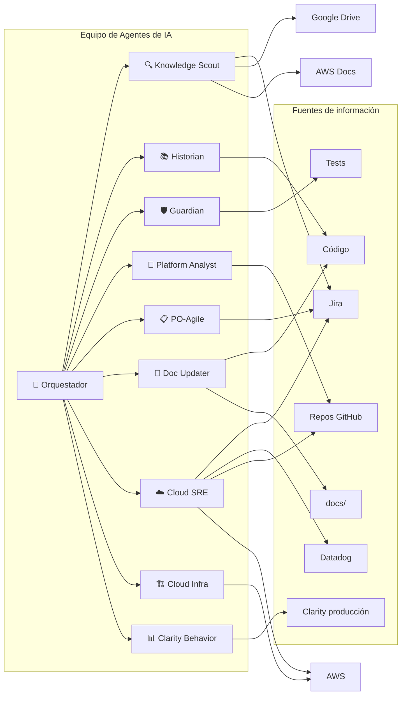

# Arquitectura Funcional de Agentes

> **Documento para negocio:** Explica cómo trabajan los agentes de IA en el proyecto y qué valor aportan.

---

## ¿Qué problema resolvemos?

Las tareas de desarrollo suelen requerir **muchos pasos manuales**: leer tickets en Jira, revisar el código, planificar cambios, validar que todo funcione. Esto consume tiempo y puede generar errores por falta de contexto.

**Los agentes automatizan y coordinan** estas fases, reduciendo tiempo y aumentando la trazabilidad entre negocio (Jira) y calidad (tests).

---

## El equipo de agentes en una imagen



> **Cloud SRE:** investiga alertas de Datadog, diagnostica infraestructura AWS, correlaciona con repos y crea trazabilidad en Jira. Puede correr como automation programada o en chat.

> **Cloud Infra:** audita costos, seguridad, inventario y optimización de recursos AWS. Solo lectura.

> **[Abrir en Draw.io](../diagrams/equipo-agentes.html)** — Editar diagrama en la aplicación

| Agente | Rol en lenguaje simple | ¿Qué hace? |
|--------|------------------------|-------------|
| **🎯 Orquestador** | El coordinador | **Siempre** elige qué especialista actúa y lo **activa** vía subagentes; no absorbe el trabajo de dominio salvo petición explícita del usuario en ese mensaje |
| **🔍 Knowledge Scout** | El explorador documental | Lee Jira, Confluence, Google Drive y AWS Docs para extraer requisitos y conocimiento |
| **📚 Historian** | El experto en historia | Revisa el código y los cambios recientes para evitar repetir errores del pasado |
| **🛡️ Guardian** | El validador | Ejecuta pruebas automáticas y solo da por terminada la tarea cuando todo pasa |
| **📂 Platform Analyst** | El analista de plataforma | Analiza repositorios externos de la plataforma (PRs, archivos, commits, estructura) vía MCP GitHub |
| **📋 PO-Agile** | El Product Owner | Transforma requisitos en Historias de Usuario listas para Jira (formato INVEST, criterios Dado-Cuando-Entonces) |
| **📝 Doc Updater** | El documentador | Actualiza la documentación cuando el código cambia con una solución definitiva (se activa en pre-commit) |
| **☁️ Cloud SRE** | El ingeniero SRE | Investiga alertas de Datadog, diagnostica infraestructura AWS, correlaciona con repos GitHub y crea trazabilidad en Jira |
| **🏗️ Cloud Infra** | El auditor de infra | Audita costos, seguridad, inventario de recursos y optimización en AWS. Solo lectura. Genera reportes |
| **📊 Clarity Behavior** | El analista de UX en producción | Consulta **Microsoft Clarity** (métricas, grabaciones, documentación) para entender comportamiento real de usuarios; no sustituye a Playwright salvo que se pida correlación explícita |

### Activación en el IDE

En el IDE, el Orquestador anuncia la decisión y activa al especialista adecuado vía subagentes, según el mapa en `.kiro/steering/00-swarm-orchestrator.md`. El script `npm run demo:agentes` solo **ilustra** el flujo en consola; no sustituye la activación real.

---

## Flujo completo: de la idea al resultado validado

```mermaid
flowchart TB
    subgraph entrada [Entrada]
        U[👤 Usuario: "Necesito implementar X"]
    end

    subgraph fases [4 Fases del Protocolo]
        F1[1️⃣ ANÁLISIS<br/>Scout lee Jira]
        F2[2️⃣ CONTEXTO<br/>Historian revisa código]
        F3[3️⃣ PLANIFICACIÓN<br/>Plan en WORKSPACE_ROOT/plans/]
        F4[4️⃣ VALIDACIÓN<br/>Guardian ejecuta Playwright]
    end

    subgraph salida [Salida]
        R[✅ Tarea completada con reporte de éxito]
    end

    U --> F1
    F1 --> F2
    F2 --> F3
    F3 --> F4
    F4 --> R
```

> **[Abrir en Draw.io](../diagrams/4-fases-protocolo.html)** — Editar diagrama en la aplicación

---

## Detalle por fase (para explicar en reuniones)

### 1️⃣ Fase de Análisis — Knowledge Scout

**Pregunta que responde:** *¿Qué dice la documentación?*

- Conecta con **Jira**, **Confluence**, **Google Drive** y **AWS Docs**
- Lee tickets, páginas, documentos y guías técnicas
- Extrae los requerimientos y conocimiento en lenguaje claro

**Valor para negocio:** Trazabilidad directa entre lo que piden las fuentes documentales y lo que se implementa.

---

### 2️⃣ Fase de Contexto — Historian

**Pregunta que responde:** *¿Qué impacto tendrá este cambio?*

- Revisa el **código actual** del proyecto
- Analiza **cambios recientes** (PRs, commits)
- Identifica riesgos y dependencias

**Valor para negocio:** Menos errores por falta de contexto; decisiones más informadas.

---

### 3️⃣ Fase de Planificación

**Pregunta que responde:** *¿Cómo lo haremos paso a paso?*

- Genera un **plan escrito** antes de tocar código
- Se guarda en `{WORKSPACE_ROOT}/plans/`
- Permite revisar la estrategia antes de ejecutar

**Valor para negocio:** Transparencia y posibilidad de ajustar el enfoque antes de invertir tiempo en desarrollo.

---

### 4️⃣ Fase de Validación — Guardian

**Pregunta que responde:** *¿Funciona correctamente?*

- Ejecuta **pruebas automáticas** (Playwright)
- Si algo falla, propone correcciones
- Solo da por terminada la tarea cuando las pruebas pasan

**Valor para negocio:** Calidad asegurada; menos bugs en producción.

---

### 5️⃣ Agente especializado — Platform Analyst

**Pregunta que responde:** *¿Cómo está el código de la plataforma?*

- Analiza **repositorios externos** definidos en `platforms.json` (org/repos)
- Usa MCP GitHub para: archivos, PRs, commits, búsqueda de código, estructura
- Se activa al planificar o al trabajar con config de plataforma

**Valor para negocio:** Contexto completo de la plataforma sin clonar; análisis de múltiples repos en un solo flujo.

---

### 6️⃣ Agente especializado — PO-Agile

**Pregunta que responde:** *¿Cómo expresamos este requisito como Historia de Usuario lista para Sprint?*

- Transforma **requisitos, ideas o descripciones** en Historias de Usuario impecables
- Aplica formato **INVEST** y criterios de aceptación **Dado-Cuando-Entonces**
- Se activa al trabajar con planes, specs o docs (`{WORKSPACE_ROOT}/plans/`, `**/docs/**`, `**/*.spec.md`)
- Puede crear la HU directamente en **Jira** vía MCP Atlassian si se solicita

**Valor para negocio:** Historias claras y listas para desarrollo; menos ambigüedad en el backlog; criterios de aceptación testables.

---

### 7️⃣ Agente especializado — Doc Updater

**Pregunta que responde:** *¿La documentación refleja el código que acabamos de cambiar?*

- Actualiza `docs/` y referencias cuando hay una solución estable
- Puede usar el skill de diagramas Draw.io si cambian flujos visuales
- El hook **pre-commit** (`.githooks/pre-commit`) recuerda revisar docs si solo cambió código

**Valor para negocio:** Menos deuda de documentación; onboarding y operación alineados con el estado real del repo.

---

### 8️⃣ Cloud SRE — alertas Datadog + diagnóstico AWS

**Pregunta que responde:** *¿Hay incidentes activos y cuál es el estado real de la infraestructura?*

- Investiga alertas de **Datadog** (monitores, logs, métricas, traces)
- Diagnostica el estado de **infraestructura AWS** (ECS tasks, RDS status, ALB health, CloudWatch alarms)
- Correlaciona con **repos GitHub** para identificar código relacionado
- Genera planes en `{WORKSPACE_ROOT}/plans/` y puede crear o enriquecer historias en **Jira**
- Puede ejecutarse como **automation programada** o en conversación interactiva

**Valor para negocio:** Ciclo completo de respuesta a incidentes: alerta → diagnóstico de infra → código → trazabilidad. Menos tiempo de resolución (MTTR).

---

### 9️⃣ Cloud Infra — auditoría de infraestructura AWS

**Pregunta que responde:** *¿Cómo está nuestra infraestructura y dónde podemos mejorar?*

- Audita **costos** con Cost Explorer (por servicio, por tag, tendencias, savings plans)
- Revisa **seguridad** (Security Groups abiertos, buckets públicos, certificados por vencer, encryption)
- Genera **inventario de recursos** (ECS, RDS, S3, ALB, CloudFront, Lambda)
- Identifica **oportunidades de optimización** (recursos no usados, right-sizing)
- Verifica **compliance de tagging** según reglas organizacionales
- Genera reportes en `Workspace/{plataforma}/reports/`

**Valor para negocio:** Gobierno de infraestructura proactivo; reducción de costos; cumplimiento de seguridad y tagging sin auditorías manuales.

---

### 🔟 Agente especializado — Clarity Behavior

**Pregunta que responde:** *¿Qué hacen los usuarios en producción y dónde hay fricción?*

- Usa el MCP **@microsoft/clarity-mcp-server** según el steering `agent-clarity-behavior.md` y el inventario técnico.
- Complementa a tests E2E (Guardian): Clarity aporta datos de **tráfico real**, no validación automatizada del repo.

**Valor para negocio:** Decisiones de producto y UX basadas en señales de uso, no solo en código o entorno de prueba.

---

## Resumen ejecutivo (una diapositiva)

| Concepto | Explicación |
|----------|-------------|
| **Qué es** | Un equipo de agentes de IA que coordina análisis, planificación y validación de tareas de desarrollo |
| **Cómo trabaja** | 4 fases secuenciales: Análisis (Jira) → Contexto (código) → Planificación → Validación (tests) |
| **Beneficio principal** | Acelera el ciclo de desarrollo con trazabilidad a Jira y validación automática de calidad |
| **Herramientas integradas** | Jira, Confluence, Google Drive, AWS Docs, GitHub, Playwright, Datadog, AWS, Microsoft Clarity (vía agente dedicado), Figma (vía Power) |
| **Agentes especializados** | Platform Analyst, PO-Agile, Doc Updater, Clarity Behavior; **Cloud SRE** (Datadog+AWS→Jira); **Cloud Infra** (auditoría AWS) |

---

## Documentos técnicos relacionados

- [0-overview.md](./0-overview.md) — Visión general del proyecto
- [4-workspace.md](./4-workspace.md) — Dónde se guardan los planes y reportes
- [6-inventario-agentes.md](./6-inventario-agentes.md) — **Inventario unificado** de agentes (MCPs, skills, archivos, prompt)
- [../ESTRUCTURA.md](../ESTRUCTURA.md) — Estructura completa del proyecto
